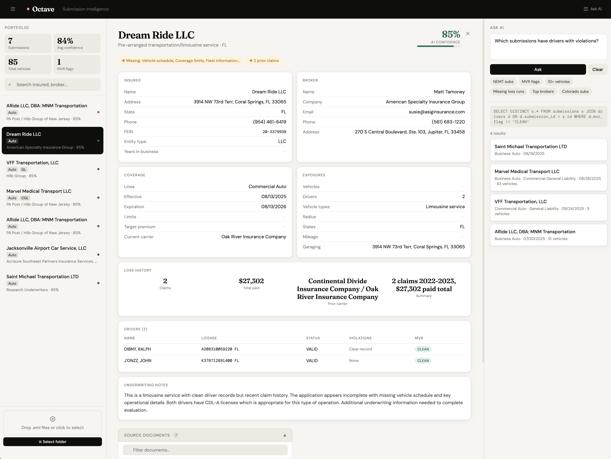

# Octave Submission Intelligence

An AI-powered commercial insurance submission processing system. Upload `.eml` files, extract structured underwriting data with Claude, and query your portfolio in plain English.



---

## Quick Start

```bash
# 1. Create virtual environment
python -m venv .venv
source .venv/bin/activate   # Windows: .venv\Scripts\activate

# 2. Install dependencies
pip install -r requirements.txt

# 3. Add your Anthropic API key
echo "ANTHROPIC_API_KEY=sk-ant-..." > .env

# 4. (Optional) Install poppler for scanned PDF support
brew install poppler         # macOS
apt install poppler-utils    # Linux

# 5. Start the server
cd backend
uvicorn main:app --reload --port 8000

# 6. Open the dashboard
open http://localhost:8000
```

---

## Architecture

```
octave-submission-intelligence/
├── backend/
│   ├── main.py          # FastAPI — routes, WebSocket, background tasks
│   ├── database.py      # SQLite schema, connection, migrations
│   ├── queries.py       # All SQL in one place (no ORM by design)
│   ├── email_parser.py  # .eml parsing, PDF extraction, vision fallback
│   └── extractor.py     # Claude extraction prompt + NL-to-SQL
├── frontend/
│   └── index.html       # Vanilla JS dashboard — no build step
├── data/
│   ├── emails/          # Uploaded .eml files
│   ├── docs/            # Extracted PDF attachments per submission
│   └── submissions.db   # SQLite (auto-created)
├── .env                 # API key — never committed
└── requirements.txt
```

---

## How It Works

### Ingestion Pipeline

Each `.eml` file is processed as a background task so the HTTP response returns immediately and the WebSocket drives all status updates in real time.

**Parse** (`email_parser.py`)

- Extracts email headers, body, and all PDF attachments
- Saves every PDF to `data/docs/{submission}/` for later viewing
- Text-based PDFs (ACORD forms, MVRs, vehicle schedules) → `pdfminer.six`
- Scanned/image PDFs (loss runs, driver licences) → converted to PNG → Claude vision
- Skips irrelevant attachments (resumes, registration photos) to conserve context
- Atomic write: saves to a temp folder first, swaps on success — failed parses never corrupt existing docs

**Extract** (`extractor.py`)

- Sends multimodal content to `claude-sonnet-4-20250514`
- Returns structured JSON: insured, broker, coverage, exposures, loss history, drivers, vehicles
- Confidence score 0–100 per submission
- Missing field detection and underwriting flags

**Store** (`database.py` + `queries.py`)

- Normalised into 4 tables: `submissions`, `vehicles`, `drivers`, `claims`
- `PRAGMA foreign_keys = ON` — cascade deletes work correctly
- Unique index on `email_filename` prevents duplicate ingestion
- Startup migration cleans any orphaned rows from previous runs

### API

| Endpoint                     | Method    | Purpose                                                    |
| ---------------------------- | --------- | ---------------------------------------------------------- |
| `/api/ingest`                | POST      | Upload .eml — returns immediately, processes in background |
| `/api/submissions`           | GET       | List all (`?search=` supported)                            |
| `/api/submissions/{id}`      | GET       | Full detail with vehicles, drivers, claims                 |
| `/api/submissions/{id}`      | DELETE    | Cascade deletes related records                            |
| `/api/submissions/{id}/docs` | GET       | List saved PDF attachments                                 |
| `/api/docs/{id}/{filename}`  | GET       | Serve PDF inline for browser viewing                       |
| `/api/query`                 | POST      | Natural language → SQL → results                           |
| `/api/stats`                 | GET       | Portfolio summary stats                                    |
| `WS /ws/live`                | WebSocket | Real-time processing event stream                          |

### WebSocket Events

The server pushes these events during ingestion:

```
started    → file received, processing begins
parsing    → reading email and attachments
extracting → Claude AI running
complete   → success (includes insured name + confidence)
error      → failed (includes specific error message)
```

### Ask AI (NL Query)

Natural language questions are translated to SQLite SELECT by Claude using the full schema as context — including the joined `drivers` and `vehicles` tables. Only SELECT is permitted.

Examples that work well:

- _"Which submissions have drivers with violations?"_
- _"Show all NEMT submissions"_
- _"Submissions missing loss runs"_
- _"List brokers by number of submissions"_

### Dashboard

Single-file `index.html` — vanilla JS, no framework, no build step.

**Design decision:** React would add a build toolchain with no benefit at this scale. Three panels, one data fetch loop, WebSocket updates. The choice is intentional, not a limitation.

Features:

- **Status pill** — hidden when idle, shows `Processing N files…` → `Done` → hides
- **Job queue** — per-file progress with spinner → name + confidence on complete
- **Submission inbox** — live-updating list, abbreviated line-of-business badges, confidence colour coding
- **Detail cards** — full underwriting layout: insured, broker, coverage, exposures, loss history, driver MVR table, vehicle table, AI notes
- **Source documents tray** — collapsible list of all PDF attachments with type badges (Loss Run, MVR, ACORD, etc.), filter input, inline PDF viewer
- **Ask AI panel** — natural language query with example chips
- **Hamburger toggles** — collapse left/right panels for focused reading
- **API error banner** — persistent red banner with direct billing link when Anthropic credits run out

---

## Design Decisions

**Raw SQL over ORM** — all queries centralised in `queries.py`. SQLAlchemy would add complexity and hide what's actually running. One file to audit, one file to optimise.

**Background tasks over synchronous ingestion** — Claude extraction takes 10–20s per email. Returning immediately and pushing progress via WebSocket gives a professional real-time feel and allows multiple files to process concurrently.

**Two-layer PDF strategy** — `pdfminer.six` for text-based PDFs (fast, free), Claude vision for scanned documents (loss runs, driver licences that pdfminer returns nothing for). Graceful fallback if poppler isn't installed.

**Atomic doc writes** — temp folder → swap on success. A crash mid-parse never leaves a submission with partially written or missing documents.

**Confidence scoring** — Claude rates its own extraction. Surfaces as colour-coded indicators throughout the UI. Below 70 = amber flag.

**Single-file frontend** — no build toolchain means zero setup friction during the demo and code review.

---

## Scaling Path

The current architecture is intentionally layered so each component swaps independently:

| Component        | Current               | Production swap                                  |
| ---------------- | --------------------- | ------------------------------------------------ |
| Database         | SQLite                | PostgreSQL — one connection string change        |
| Task queue       | `asyncio.create_task` | Celery + Redis — one decorator change            |
| Document storage | Local `data/docs/`    | S3 + presigned URLs — one function change        |
| Concurrency      | Sequential per upload | Semaphore-limited parallel with `asyncio.gather` |
| Search           | SQL LIKE              | pgvector embeddings for semantic similarity      |
